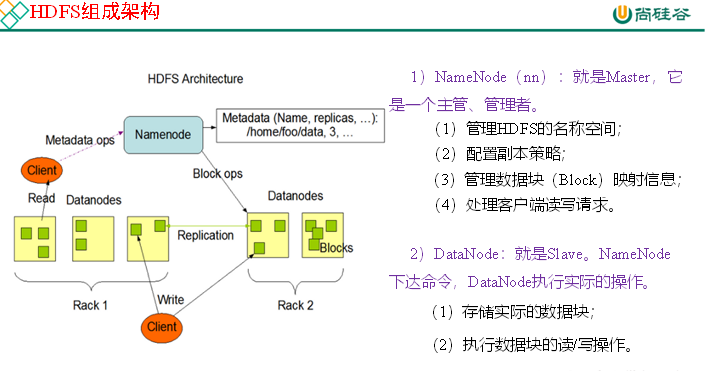

### Hadoop-HDFS

#### HDFS概述

##### 概念

Hadoop distributed file system(hadoop分布式文件系统)

分布式： 多台电脑一起存

HDFS只是分布式文件管理系统中的一种

特点： 适合一次写入，多次写出的场景，且不支持文件的修改

##### 优缺点

1. 高容错性（自动保存多个副本，多个副本在不同节点上，副本丢失，可以自动恢复）
2. 适合处理大数据（数据规模大）
3. 可构建在廉价机器上，通过多副本机制，提高可靠性（廉价是跟超算比较）

缺点：

1. 不适合低延时数据
2. 无法高效对大量小文件进行存储
3. 不支持并发写入，文件随机修改（仅支持数据append（追加））



HDFS存储的单位是块，而不是文件


#### HDFS Shell操作

在/opt/module/hadoop-2.7.2下面

hadoop fs -put etc /

或者

hdfs dfs -put etc /

把etc上传到hdfs根目录下


##### HDFS命令分类

本地-》HDFS
    put
    copyFromLocal   从本地复制到HDFS，与put一样
    moveFromLocal  剪切
    appendToFile
HDFS-》HDFS
    cp
    mv
    chown
    chgrp
    chmod
    mkdir
    du
    df
    cat

​	rm

HFDS-》本地
    get     下载
    getmerge   合并下载
    copyToLocal   与get一样


例如

hadoop fs -put etc /

hadoop fs -cp /etc /etc2

hadoop fs -rm -r /etc2

本地   df -h查看文件的使用情况

hadoop fs -df -h

du -h /home 每个文件夹占用空间大小

hadoop fs -du -h  /


mkdir test

cd test

cat <<EOF >>1.txt

111

111

111

EOF
cat <<EOF >>2.txt

222

222

222

EOF

hadoop fs -mkdir /test

hadoop fs -put 1.txt /test

hadoop fs -appendToFile 2.txt /text/1.txt

hadoop fs -cat /text/1.txt


get

hadoop fs -get /wcoutput ./

getmerge合并下载

hadoop fs -getmerge /test/* merger.txt


设置副本

hadoop fs -setrep 10 /test/1.txt


```
package com.atguigu.hdfsclient;

import org.apache.hadoop.conf.Configuration;
import org.apache.hadoop.fs.FileSystem;
import org.apache.hadoop.fs.Path;
import org.junit.Test;

import java.io.IOException;
import java.net.URI;


public class HDFSClient {
    @Test
    public void put() throws IOException, InterruptedException {
        Configuration configuration = new Configuration();
        // 获取一个HDFS的抽象封装对象
        FileSystem fileSystem = FileSystem.get(URI.create("hdfs://hadoop102:9000"),configuration,"atguigu");
        // 用这个对象操作文件系统
        fileSystem.copyToLocalFile(new Path("/test"),new Path("d:\\"));
        // 关闭文件系统
        fileSystem.close();
    }
}
```


#### HDFS 读写流程

写：  上传

读： 下载


