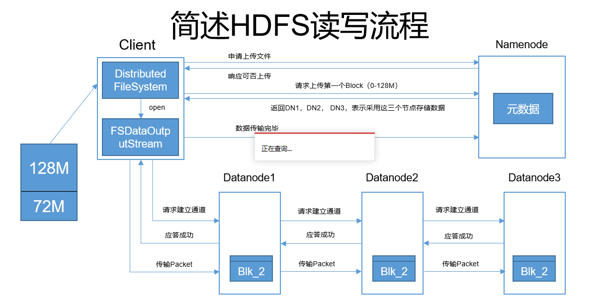
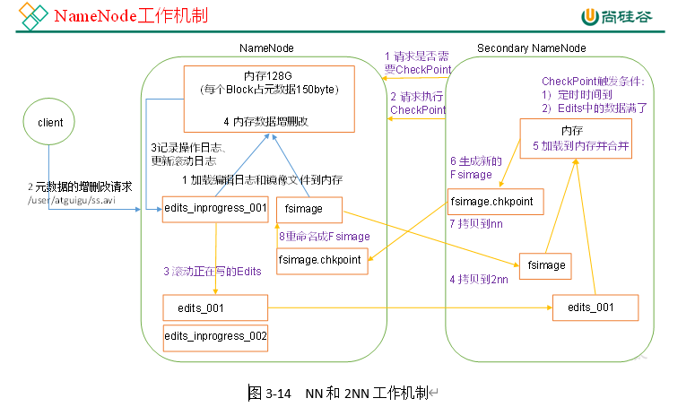
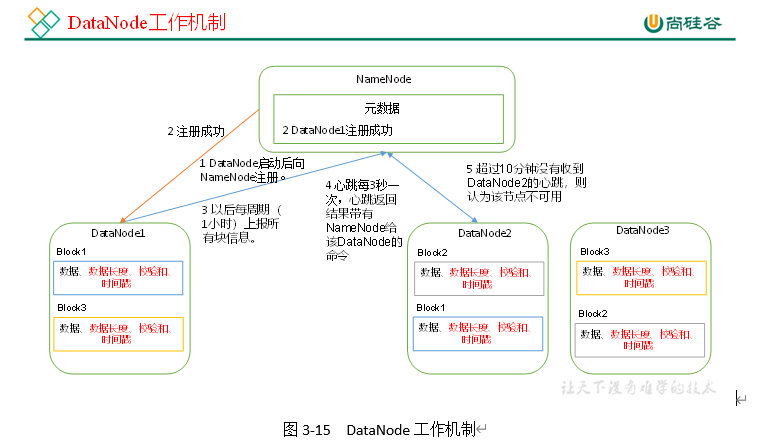
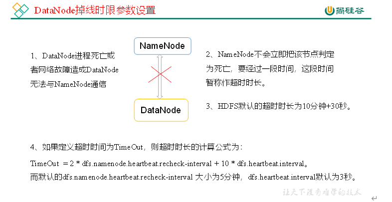
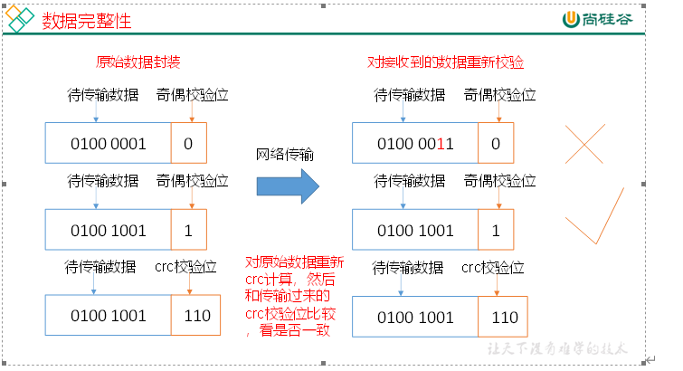

### Hadoop-HDFS

#### HDFS概述

##### 概念

Hadoop distributed file system(hadoop分布式文件系统)

分布式： 多台电脑一起存

HDFS只是分布式文件管理系统中的一种

特点： 适合一次写入，多次写出的场景，且不支持文件的修改

##### 优缺点

1. 高容错性（自动保存多个副本，多个副本在不同节点上，副本丢失，可以自动恢复）
2. 适合处理大数据（数据规模大）
3. 可构建在廉价机器上，通过多副本机制，提高可靠性（廉价是跟超算比较）

缺点：

1. 不适合低延时数据
2. 无法高效对大量小文件进行存储
3. 不支持并发写入，文件随机修改（仅支持数据append（追加））


HDFS存储的单位是块，而不是文件


#### HDFS Shell操作

在/opt/module/hadoop-2.7.2下面

hadoop fs -put etc /

或者

hdfs dfs -put etc /

把etc上传到hdfs根目录下


##### HDFS命令分类

本地-》HDFS
    put
    copyFromLocal   从本地复制到HDFS，与put一样
    moveFromLocal  剪切
    appendToFile
HDFS-》HDFS
    cp
    mv
    chown
    chgrp
    chmod
    mkdir
    du
    df
    cat

​	rm

HFDS-》本地
    get     下载
    getmerge   合并下载
    copyToLocal   与get一样


例如

hadoop fs -put etc /

hadoop fs -cp /etc /etc2

hadoop fs -rm -r /etc2

本地   df -h查看文件的使用情况

hadoop fs -df -h

du -h /home 每个文件夹占用空间大小

hadoop fs -du -h  /


mkdir test

cd test

cat <<EOF >>1.txt

111

111

111

EOF
cat <<EOF >>2.txt

222

222

222

EOF

hadoop fs -mkdir /test

hadoop fs -put 1.txt /test

hadoop fs -appendToFile 2.txt /text/1.txt

hadoop fs -cat /text/1.txt


get

hadoop fs -get /wcoutput ./

getmerge合并下载

hadoop fs -getmerge /test/* merger.txt


设置副本

hadoop fs -setrep 10 /test/1.txt


```
package com.atguigu.hdfsclient;

import org.apache.hadoop.conf.Configuration;
import org.apache.hadoop.fs.FileSystem;
import org.apache.hadoop.fs.Path;
import org.junit.Test;

import java.io.IOException;
import java.net.URI;


public class HDFSClient {
    @Test
    public void put() throws IOException, InterruptedException {
        Configuration configuration = new Configuration();
        // 获取一个HDFS的抽象封装对象
        FileSystem fileSystem = FileSystem.get(URI.create("hdfs://hadoop102:9000"),configuration,"atguigu");
        // 用这个对象操作文件系统
        fileSystem.copyToLocalFile(new Path("/test"),new Path("d:\\"));
        // 关闭文件系统
        fileSystem.close();
    }
}
```


#### HDFS 读写流程

写：  上传

读： 下载


HDFS上传流程




HDFS下载流程


拓扑距离和机架感知

For the common case, when the replication factor is three, HDFS’s placement policy is to put one replica on one node in the local rack, another on a different node in the local rack, and the last on a different node in a different rack.


#### Maven回顾

maven  管理项目的工具

#### NameNode，SecondaryNameNode

思考：NameNode中的元数据是存储在哪里的？
        首先，我们做个假设，如果存储在NameNode节点的磁盘中，因为经常需要进行随机访问，还有响应客户请求，必然是效率过低。因此，元数据需要存放在内存中。但如果只存在内存中，一旦断电，元数据丢失，整个集群就无法工作了。因此产生在磁盘中备份元数据的FsImage。
        这样又会带来新的问题，当在内存中的元数据更新时，如果同时更新FsImage，就会导致效率过低，但如果不更新，就会发生一致性问题，一旦NameNode节点断电，就会产生数据丢失。因此，引入Edits文件(只进行追加操作，效率很高)。每当元数据有更新或者添加元数据时，修改内存中的元数据并追加到Edits中。      	    这样，一旦NameNode节点断电，可以通过FsImage和Edits的合并，合成元数据。
        但是，如果长时间添加数据到Edits中，会导致该文件数据过大，效率降低，而且一旦断电，恢复元数据需要的时间过长。因此，需要定期进行FsImage和Edits的合并，如果这个操作由NameNode节点完成，又会效率过低。因此，引入一个新的节点SecondaryNamenode，专门用于FsImage和Edits的合并。


Redis（持久化策略）                                                                                                                             HDFS

RDB  内存镜像放磁盘上-> 生成慢，加载快，安全性略低                                                                   Fsimage 内存镜像                                                          

AOF  整个操作流程 ->每一步操作实时记录，安全性更高，																edits.log  记录了hadoop每一步的元数据变动，大，加载慢

​									占用空间大，生成快，加载慢

​                                                                         




Fsimage   内存上存档

edits.log   小纸条

2nn辅助nn工作，并不能成为nn的热备，永远不能代替nn工作

edits会永远保存，fsimage只保留最新的和上一个

#### DataNode






思考：如果电脑磁盘里面存储的数据是控制高铁信号灯的红灯信号（1）和绿灯信号（0），但是存储该数据的磁盘坏了，一直显示是绿灯，是否很危险？同理DataNode节点上的数据损坏了，却没有发现，是否也很危险，那么如何解决呢？

如下是DataNode节点保证数据完整性的方法。

1）当DataNode读取Block的时候，它会计算CheckSum。

2）如果计算后的CheckSum，与Block创建时值不一样，说明Block已经损坏。

3）Client读取其他DataNode上的Block。

4）DataNode在其文件创建后周期验证CheckSum，如图3-16所示。

​                             



#### 扩展新节点

scp -r hadoop102: jdk1.8.0_271/ hadoop105:/opt/module

scp -r hadoop102: hadoop-2.7.2/ hadoop105:/opt/module

sudo scp -r hadoop102:/etc/profile hadoop105:/etc/

source /etc/profile

java

hadoop version

hadoop105 删除rm -rf data logs

hadoop-daemon.sh start datanode

#### 退役旧节点（白名单更严格，黑名单更温和，用黑名单）

放在主机进行

cd /opt/module/hadoop-2.7.2/etc/hadoop

vi blacklist(把要退役的机器放在黑名单中)

hadoop102

vi hdfs-site.xml

  <property>
                <name>dfs.hosts.exclude</name>
                <value>/opt/module/hadoop-2.7.2/etc/hadoop/blacklist</value>
        </property>


刷新   hdfs dfsadmin -refreshNodes


白名单

cd /opt/module/hadoop-2.7.2/etc/hadoop

vi whitelist(把要留着的机器存在白名单中)

hadoop102

hadoop103

hadoop104

vi hdfs-site.xml

 <property>
                <name>dfs.hosts</name>
                <value>/opt/module/hadoop-2.7.2/etc/hadoop/whitelist</value>
        </property>

hdfs dfsadmin -refreshNodes

黑名单才是用来退役的，白名单是维持安全性的

#### datanode多目录配置

hdfs-site.xml

<property>

​    <name>dfs.datanode.data.dir</name>

<value>file:///${hadoop.tmp.dir}/dfs/data1,file:///${hadoop.tmp.dir}/dfs/data2</value>

</property>

scp -r hadoop102: hadoop hadoop104:/opt/module/hadoop-2.7.2/etc

start-dfs.sh

start-yarn.sh

 mr-jobhistory-daemon.sh start historyserver

#### HDFS 2.X新特性

小文件存档

集群间数据拷贝