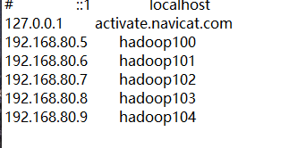
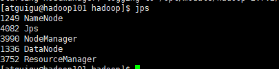
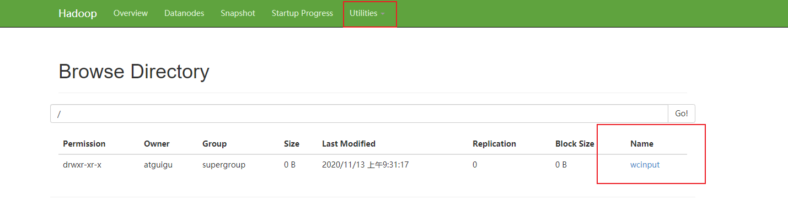
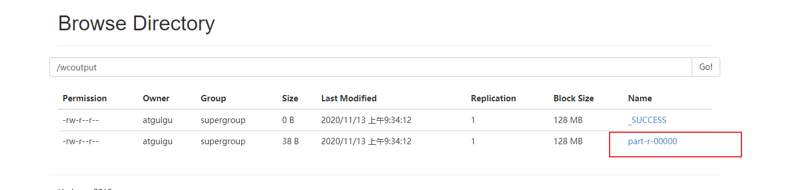

### Hadoop 运行环境搭建

#### 1. 虚拟机环境配置

##### 1.1 关闭防火墙

systemctl stop firewalld.service   关闭防火墙

systemctl disable firewalld.service    关闭开机自启动

systemctl status firewalld.service   查看防火墙是否已关闭

##### 1.2 创建一个一般用户atguigu

useradd atguigu

ll /home   查看是否已添加用户

passwd atguigu

##### 1.3 在/opt目录下创建software module文件夹，并更改所有权

mkdir /opt/software /opt/module

ll /opt

chown atguigu:atguigu /opt/software /opt/module

##### 1.4 把这个用户加到sudoers

vim /etc/sudoers

atguigu   ALL=（ALL）     ALL

su atguigu

sudo ls

exit;

##### 1.5 改hosts

vim /etc/hosts

192.168.80.5   hadoop100

192.168.80.6   hadoop101

192.168.80.7  hadoop102

##### 1.6 改静态ip

vim /etc/sysconfig.network-scripts/ifcfg-ens33

DEVICE=ens33

TYPE=Ethernet

ONBOOT=yes

BOOTPROTO=static

IPADDR=192.168.80.5

PREFIX=24

GATEWAY=192.168.80.2

DNS1=8.8.8.8

DNS2=8.8.8.2

NAME=ens33

systemctl restart network

##### 1.7 改主机名字

hostnamectl set-hostname hadoop100

hostname

关机并拍快照

#### 2. 安装JDK,hadoop

##### 2.1 拷贝jdk  hadoopjar包

##### 2.2 解压

tar -zxvf jar包名  -C /opt/module

tar -zxvf haddop  -C /opt/module

ll

##### 2.3 配置环境变量(java  hadoop)

sudo vim /etc/profile

#JAVA_HOME
export JAVA_HOME=/opt/module/jdk1.8.0_271
export PATH=$PATH:$JAVA_HOME/bin

保存后执行source /etc/profile

echo $JAVA_HOME

java -version

sudo vi /etc/profile

#HADOOP_HOME
export HADOOP_HOME=/opt/module/hadoop-2.7.2
export PATH=$PATH:$HADOOP_HOME/bin:$HADOOP_HOME/sbin

保存后执行source /etc/profile

hadoop version

#### 3. 官网走一遍（本地运行模式）

##### 3.1 本地运行模式，单点设置（官方grep案例）

vi`etc/hadoop/hadoop-env.sh` 

export JAVA_HOME=/opt/module/jdk1.8.0_271

保存后执行  bin/hadoop

在hadoop2.7.2文件下面创建一个input文件夹

mkdir input

将hadoop的xml配置文件复制到input

cp etc/hadoop/*.xml input

执行share目录下的mapreduce程序

bin/hadoop jar share/hadoop/mapreduce/hadoop-mapreduce-examples-2.9.2.jar grep input output 'dfs[a-z.]+'

查看输出结果

cat output/*

3.2 官方WordCount案例

创建在hadoop2.7.2文件下面创建一个wcinput文件夹

mkdir wcinput

在wcinput文件下创建一个wc.input

cd wcinput

编辑wc.input文件

vi /wc.input

在文件中中输入如下内容

hadoop yarn

hadoop mapreduce

atguigu

atguigu

保存并退出

回到/opt/module/hadoop2.7.2

执行    bin/hadoop jar share/hadoop/mapreduce/hadoop-mapreduce-examples-2.7.2.jar wordcount wcinput wcoutpt

cat wcoutput/*

以上都是hadoop本地运行模式

只用到了mapreduce，mapreduce跑在了本地存储和资源调度

##### 3.2 伪分布运行模式（只有一个节点的分布式）

###### 3.2.1 启动HDFS并运行MapReduce程序

1. 配置hadoop-env.sh

   在/opt/module/hadoop2.7.2目录下

   vi etc/hadoop/hadoop-env.sh

   export JAVA_HOME=/opt/module/jdk1.xxxx

   保存后执行  bin/hadoop

   

   2.配置core-site.xml

   在/opt/module/hadoop2.7.2目录下

   vi etc/hadoop/core-site.xml

   <configuration>

   <!--指定HDFS中NameNode的地址-->

   ​    <property>
   ​        <name>fs.defaultFS</name>
   ​        <value>hdfs://hadoop101:9000</value>
   ​    </property>

   <!--指定Hadoop运行时产生文件的存储目录-->

     <property>
           <name>hadoop.tmp.dir</name>
           <value>/opt/module/hadoop-2.7.2/data/tmp</value>
       </property>

   </configuration>

   

   3.配置hdfs-site.xml

   在/opt/module/hadoop2.7.2目录下

   vi etc/hadoop/hdfs-site.xml

   <configuration>

   <!--指定HDFS副本数量为1-->

   ​    <property>
   ​        <name>dfs.replication</name>
   ​        <value>1</value>
   ​    </property>
   </configuration>

   4.启动集群

   格式化NameNode（第一次启动时格式化，以后就不要总格式化）

   在hadoop2.7.2目录下   bin/hdfs namenode -format

   启动NameNode

   hadoop-daemon.sh start namenode

   启动DataNode

   hadoop-daemon.sh start datanode

   5.查看集群

   查看是否启动成功

   在hadoop2.7.2目录下

   jps

   如果看到namenode和datanode就启动成功

   可以通过访问198.168.80.6:50070或者hadoop101:50070来进行查看是否成功
   
   如果遇到不能用主机名访问的情况  可以修改windows的hosts文件  添加ip   主机名
   
   
   
   为什么不能一直格式化NameNode？？？？
   
   格式化NameNode会产生新的集群id，导致NameNode和DataNode的集群id不一致，集群找不到以往的数据。所以，格式化NameNode时，一定要先删除data数据和log日志。然后再格式化NameNode
   
   如果格式化多次怎么办
   
   hadoop.daemon.sh stop datanode
   
   hadoop.daemon.sh stop namenode
   
   hdfs namenode -format
   
   hadoop-daemon.sh start namenode
   
   hadoop-daemon.sh start datanode
   
   jps
   
   再一次jps就没有datanode了
   
   cat logs/hadoop-atguigu-datanode-hadoop101.log
   
   ccd data/tmp/dfs
   
   rm data -rf
   
   hadoop-daemon.sh start datanode

###### 3.2.2 启动YARN并运行MapReduce程序

1. 配置yarn-env.sh

   配置JAVA_HOME

   在hadoop2.7.2文件下配置

   vi etc/hadoop/yarn-env.sh 

   export JAVA_HOME=/opt/module/jdk1.8.0_271

2. 配置yarn-site.xml

   vi etc/hadoop/yarn-site.xml 

   <configuration>

   <!-- Site specific YARN configuration properties -->

   <!-- Reducer获取数据的方式 -->

   ​        <property>
   ​                <name>yarn.nodemanager.aux-services</name>
   ​                <value>mapreduce_shuffle</value>
   ​        </property>

   <!-- 指定YARN的ResourceManager的地址 -->

   ​        <property>
   ​                <name>yarn.resourcemanager.hostname</name>
   ​                <value>hadoop101</value>
   ​        </property>

   </configuration>

3. 配置mapred-env.sh

   export JAVA_HOME=/opt/module/jdk1.8.0_271

4. 对mapred-site.xml.template重新命名为mapred-site.xml

   cd etc/hadoop

   ll

   cp mapred-site.xml.template mapred-site.xml

   vim mapred-site.xml

   <configuration>

   <!-- 指定MR运行在YARN上 -->

   ​        <property>
   ​                <name>mapreduce.framework.name</name>
   ​                <value>yarn</value>
   ​        </property>
   </configuration>
   ~        

   

5. 启动集群

   启动前必须保证Namenode和datanode已经启动

   启动ResourceManager

   在文件下hadoop2.7.2 

   yarn-daemon.sh start resourcemanager

   启动NodeManager

   yarn-daemon.sh start nodemanager

   jps

   

   hadoop101:8088或者198.168.80.6：8088

   

6. 跑在hdfs和yarn上面的mapreduce程序

   在文件hadoop2.7.2下，把 本地wcinput上传到hdfs

   hadoop fs -put wcinput /

   

   hadoop jar share/hadoop/mapreduce/hadoop-mapreduce-examples-2.7.2.jar wordcount /wcinput /wcoutput\

   hadoop fs -cat /wcoutput/*

   

##### 3.3 完全分布式开发模式（开发重点）

###### 3.3.1 环境配置

远程cp

scp（安全拷贝）

远程把hadoop101上的/opt/module拷贝到hadoop102相同的位置

scp -r hadoop101:/opt/module/hadoop-2.7.2 hadoop102:/opt/module

rsync用法（比scp要快）

rsync -av hadoop101:/opt/module/hadoop-2.7.2  /opt/module   （只能在hadoop102执行）

-a 归档拷贝(完完全全一样的拷贝)

-v 显示复制的过程

把java，hadoop安装包发送到三台虚拟机上

scp -r hadoop101:/opt/module/jdk1.8.0_271 /opt/module

scp -r hadoop101:/opt/module/haddop-2.7.2 /opt/module

以root权限发送

sudo scp -r hadoop101:/etc/profile /etc

source /etc/profile

java -version

hadoop version

###### 3.3.2 集群配置

集群规划

​					hadoop102                                   hadoop103                                             hadoop104

HDFS    Namenode，datanode                     datanode                                      SecondaryNameNode   DataNode

YARN    NodeManager                     ResourceManager，NodeManager                       NodeManager

核心文件配置（配置core-site.xml）

在hadoop-2.7.2下面     cd etc/hadoop

配置hadoop-env.sh     mapred-env.sh       yarn-env.sh

export JAVA_HOME=/opt/module/jdk1.8.0_271

配置core-site.xml

在hadoop-2.7.2下面      cd etc/hadoop

<configuration>
<!--指定HDFS中NameNode的地址-->
        <property>
                <name>fs.defaultFS</name>
                <value>hdfs://hadoop102:9000</value>
        </property>

<!--指定Hadoop运行时产生文件的存储目录-->

  <property>
        <name>hadoop.tmp.dir</name>
        <value>/opt/module/hadoop-2.7.2/data/tmp</value>
    </property>
</configuration>
~                   

配置hdfs-site.xml

<configuration>

<!--指定HDFS副本数-->

​        <property>
​                <name>dfs.replication</name>
​                <value>3</value>
​         </property>

<!--指定Hadoop辅助名称节点主机配置-->

​        <property>
​                <name>dfs.namenode.secondary.http-address</name>
​                <value>hadoop104:50090</value>
​        </property>
</configuration>
~                   

配置mapred-site.xml

<configuration>

<!--指定MR运行在YARN上-->

​        <property>
​                <name>mapreduce.framework.name</name>
​                <value>yarn</value>
​        </property>
</configuration>

配置yarn-site.xml

<configuration>

<!-- Reducer获取数据的方式 -->
        <property>
                <name>yarn.nodemanager.aux-services</name>
                <value>mapreduce_shuffle</value>
        </property>

<!-- 指定YARN的Resourcemanager地址 -->

​        <property>
​                <name>yarn.resourcemanager.hostname</name>
​                <value>hadoop103</value>
​        </property>

</configuration>

以上配置在hadoop102完成，我们需要把这些配置文件发送到103，104

scp -r hadoop102:/opt/module/hadoop-2.7.2/etc hadoop104:/opt/module/hadoop-2.7.2

格式化集群，在namenode节点格式化(hadoop102)

hdfs namenode -format

hadoop-daemon.sh start namenode

hadoop-daemon.sh start datanode

(hadoop103,hadoop104)

hadoop-daemon.sh start datanode

hadoop104:

hadoop-daemon.sh start secondarynamenode

###### 3.3.3 SSH无密登录配置（SSH以非对称加密实现身份验证：用a加密，用b解密）

ssh：secure shell：shell是和系统沟通的桥梁

群起集群需要使用ssh免密登录

hadoop102 需要与hadoop103通信，hadoop102登录hadoop103

ssh-keygen -t rsa

回车

回车

回车

ssh-copy-id hadoop103

ssh hadoop103

自己登录自己，hadoop102免密

ssh-copy-id hadoop102

ssh hadoop102

hadoop103

ssh-keygen -t rsa

ssh-copy-id hadoop102

ssh hadoop102

需要hadoop2到hadoop2，hadoop2到hadoop3，hadoop2到hadoop4，hadoop3到hadoop3，hadoop3到hadoop2，hadoop3到hadoop4，hadoop4到hadoop4，hadoop4到hadoop3，hadoop4到hadoop2

简单的解决方案

ssh-keygen -t rsa

ssh-copy-id hadoop102

scp -r hadoop102: .ssh hadoop103

###### 3.3.4 群起集群

停止上一次启动的namenode，datanode并且删除data和log

配置从机：hadoop102，103，104

cd /opt/module/hadoop-2.7.2/etc/hadoop

vi slaves

hadoop102

hadoop103

hadoop104

hadoop102执行   start-dfs.sh

hadoop103启动yarn（哪台机器装的resourcemanager，就在哪台机器上面启动）

start-yarn.sh

hadoop102:50070  出现三台nodes

hadoop103:8088 出现三台nodes即为成功

为了测试，可以跑一个wordcount

在Hadoop102    cd /opt/module/hadoop

hadoop fs -put wcinput /

hadoop jar share/hadoop/mapreduce/hadoop-mapreduce-example.jar wordcount /wcinput /output

jps指令查看

配置历史服务器、日志聚集

在hadoop103    stop-yarn.sh

hadoop102   stop-dfs.sh

cd etc/hadoop

vi mapred-site.xml

<!--历史服务器端地址-->

<property>

​	<name>mapreduce.jobhistory.address</name>

​	<value>hadoop104:10020</value>

</property>

<!--历史服务器web端地址-->

<property>

	<name>mapreduce.jobhistory.webapp.address</name>
	
	<value>hadoop104:19888</value>

</property>

vi yarn-site.xml

<!--日志聚集功能-->

<property>

	<name>yarn.log-aggregation-enable</name>
	
	<value>true</value>

</property>

<!--日志保留时间设置七天-->

<property>

	<name>yarn.log-aggregation.retain-seconds</name>
	
	<value>604800</value>

</property>

hadoop103,hadoop104 同步

scp -r hadoop102: /opt/module/hadoop/etc hadoop104:/opt/module/hadoop

hadoop102

start-dfs.sh

hadoop103

start-yarn.sh

hadoop104启动历史服务器

mr-jobhistory-daemon.sh start historyserver

jps

hadoop jar share/hadoop/mapreduce/hadoop-mapreduce-example.jar wordcount /wcinput /output

###### 3.3.5 集群时间同步

找一台机器，作为时间服务器，所有的机器与这台集群时间进行定时的同步，比如，每隔十分钟，同步一次时间

su -切换到root

检查ntp是否安装

rpm -qa|grep ntp

没安装的话yum install -y ntp

查看是否开始ntp服务(停止ntp服务)

systemctl ntpd stop

systemctl status ntpd

修改ntp配置文件

vi /etc/ntp.conf

#restrict 192.168.1.0 mask 255.255.255.0 nomodify notrap为
restrict 192.168.1.0 mask 255.255.255.0 nomodify notrap

server 0.centos.pool.ntp.org iburst
server 1.centos.pool.ntp.org iburst
server 2.centos.pool.ntp.org iburst
server 3.centos.pool.ntp.org iburst为
#server 0.centos.pool.ntp.org iburst
#server 1.centos.pool.ntp.org iburst
#server 2.centos.pool.ntp.org iburst
#server 3.centos.pool.ntp.org iburst

添加

server 127.127.1.0
fudge 127.127.1.0 stratum 10

保存退出

vi /etc/sysconfig/ntpd

SYNC_HWCLOCK=yes

重新启动

systemctl ntpd start

开机自启动

chkconfig ntpd on

其他机器配置（root）

crontab -e

*/10 * * * * /usr/sbin/ntpdate hadoop102

date -s "2017-9-11 11:11:11"

date

 