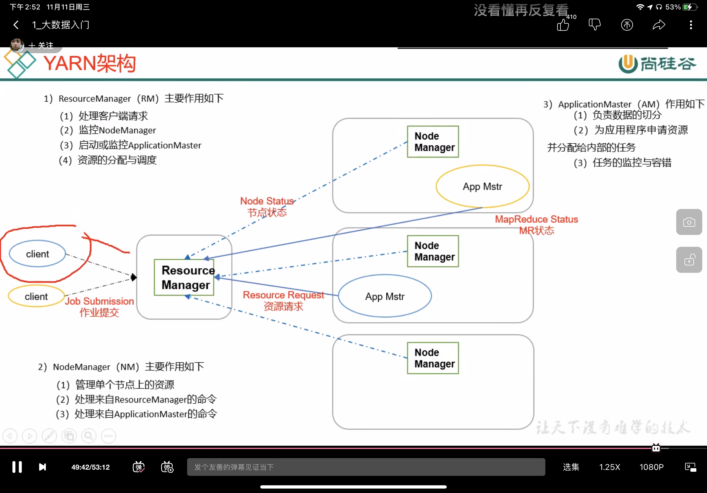

### Hadoop的组成

MapReduce  计算

Yarn  资源调度（调度内存和cpu，算力资源）

HDFS  数据存储(解决存的问题)

#### HDFS架构

NameNode（nn）：存的是数据的索引，元数据（描述数据的数据）

DataNode（dn）：存的是数据的本体，所有数据都存在这里

Secondary NameNode（2nn）：是nn的助理，不是NameNode的备份，如果nn挂了，2nn并不能顶替nn的工作，比如nn是主刀医生，2nn相当于递剪刀的，2nn可以帮助nn恢复，但是恢复有缺陷

#### Yarn架构

RM  相当于项目组组长

AM  相当于组长找的一个临时负责人

NM  小组成员

Container  是YARN中的资源抽象，它封装了某个节点上的多维度资源，如内存、CPU、磁盘、网络等，nodemanager通过启动或关闭容器来完成资源的调度

#### MapReduce架构

MapReduce将计算过程分为两个过程：Map和Reduce

1）Map阶段并行处理输入数据

2）Reduce阶段对Map结果进行汇总

