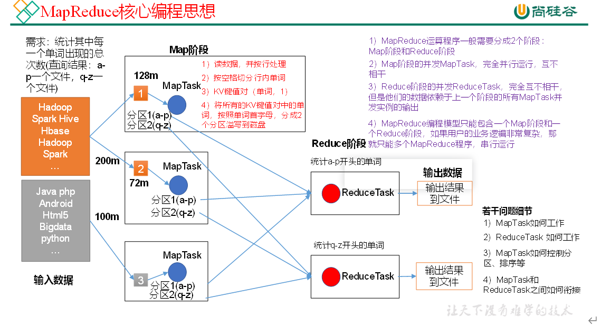
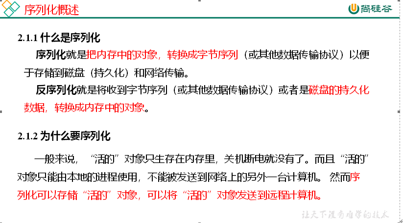
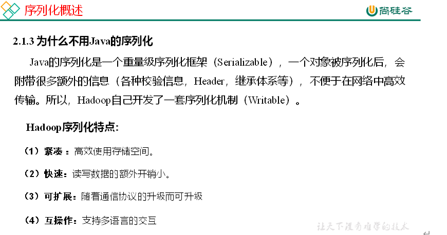
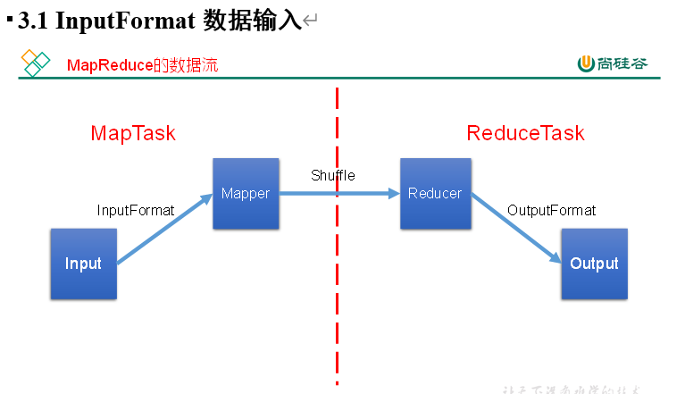
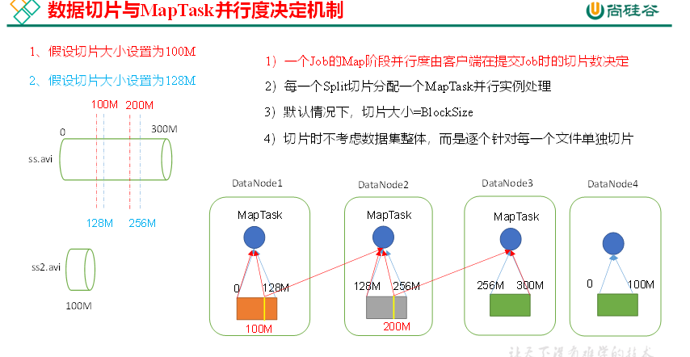
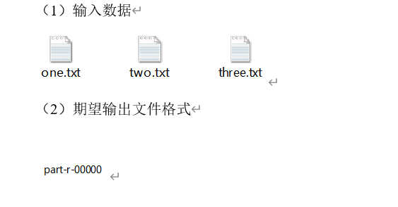
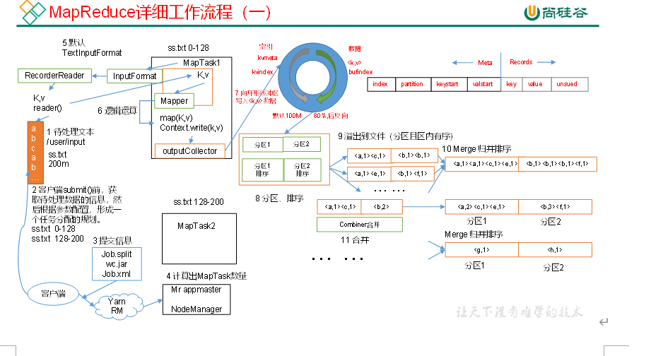
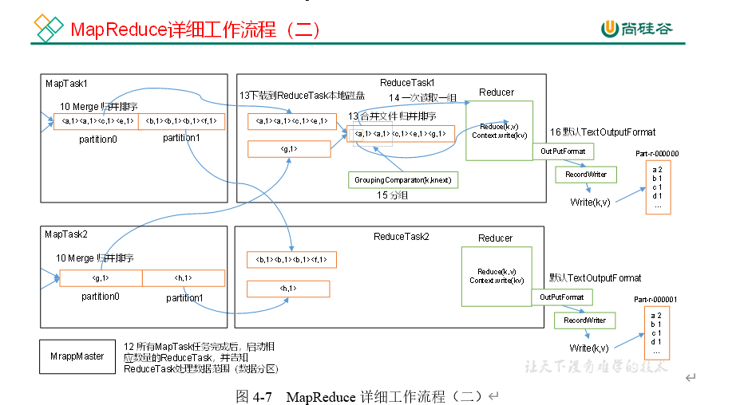
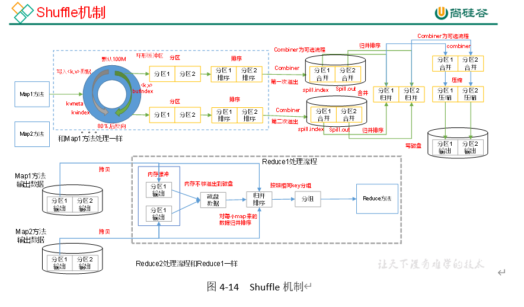
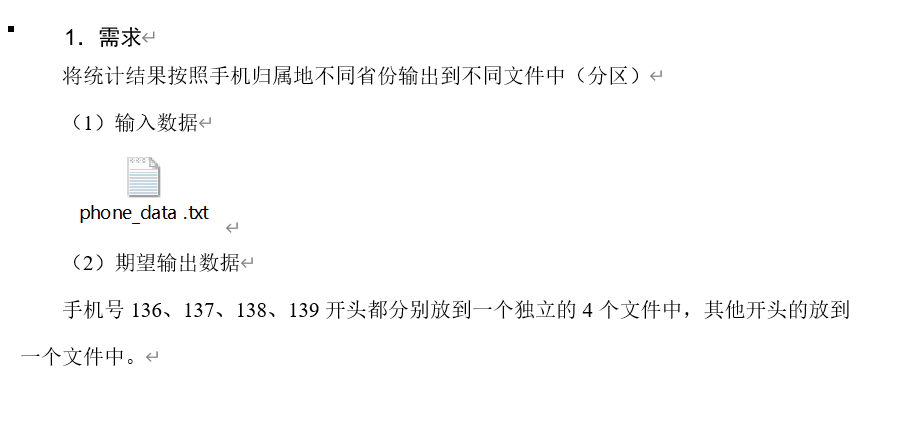

### MapReduce

#### 1. MapReduce概述

MapReduce是一个**分布式运算程序**的编程框架

MapReduce核心功能是将用户编写的业务逻辑代码和自带默认组件整合成一个完整的分布式运算程序，并发运行在一个hadoop集群上

优缺点：

1. 易于编程
2. 良好的扩展性
3. 高容错性
4. 适合PB级的以上数据的离线处理

缺点：（慢）

1. 不擅长实时计算
2. 不擅长流式计算
3. 不擅长（DAG）有向图计算

**MapReduce核心思想**

map： 映射，改变拿到的数据的形式（把数据映射为我们想要的形式）

reduce： 针对映射以后的数据来做合并处理

 **常用数据序列化类型**
表4-1 常用的数据类型对应的Hadoop数据序列化类型
Java类型	Hadoop Writable类型
Boolean	BooleanWritable
Byte	ByteWritable
Int	IntWritable
Float	FloatWritable
Long	LongWritable
Double	DoubleWritable
**String	Text**
Map	MapWritable
Array	ArrayWritable

##### WordCount案例实操

详情见github

写的java程序打包在集群上运行

hadoop jar 1.jar com.atguigu.wordcount.WcDriver wcinput /tput

#### 2. Hadoop序列化

内存中的对象变成字节序列

IO资源在hadoop中 比较珍贵，namenode内存最珍贵

##### 序列化案例实操

统计每一个手机号耗费的总上行流量、下行流量、总流量

具体代码见github

#### 3. MapReduce 框架原理

数据块：Block是HDFS物理上把数据分成一块一块。
数据切片：数据切片只是在逻辑上对输入进行分片，并不会在磁盘上将其切分成片进行存储。

InputFormat

1. 怎么切片
2. 怎样把切片变成（k，v）

InputFormat                                           切片方法                                                                                                                                kv方法

TextInputFormat                   FileInputFormat的切片方法（块大小为切片大小，按照文件切片，1.1倍）                           LineRecordReader（offset，value）

KeyValueTextInputFormat  FIleInputFormat的切片方法                                                                                                          KeyValueLineRecordReader

NLineInputFormat                自定义，N行一片                                                                                                                    		LineRecodReader

CombineTextInputFormat   小文件过多，自定义                                                                          										     CombineFileRecordReader（跨文件）

FixedLengthInputFormat    FIleInputFormat的切片方法  

SequenceFileInputFormat     FIleInputFormat的切片方法                                                                                                    SequenceFIleRecordReader

#### 4.自定义InputFormat实操 

无论HDFS还是MapReduce，在处理小文件时效率都非常低，但又难免面临处理大量小文件的场景，此时，就需要有相应解决方案。可以自定义InputFormat实现小文件的合并。
1．需求
将多个小文件合并成一个SequenceFile文件（SequenceFile文件是Hadoop用来存储二进制形式的key-value对的文件格式），SequenceFile里面存储着多个文件，存储的形式为文件路径+名称为key，文件内容为value。

见github

#### 5. MapReduce工作流程

##### shuffle机制

shuffle最重要的就是三次排序，第一次快速排序，第二次归并排序，第三次归并排序

##### Partiton

分区是自己设定的，一个分区对应一个ReduceTask。需要几个文件，就设置几个分区

Partition案例实操

见github

自定义分区，一个分区对应一个ReduceTask，对应一个输出文件

##### WritableComparable排序

见github

在实现排序的基础上实现分区，见github

##### Combiner合并

Combiner是MR程序中的Mapper和Reducer之外的一种组件

Combiner组件的父类就是Reducer

Combiner和Reducer的区别在于运行的位置

（1）Combiner是在每一个MapTask的节点运行

（2）Reducer是接收全局所有Mapper的输出结果

**Combiner是对每一个MapTask的输出进行局部汇总，减小网络传输量**

**Combiner能够应用的前提是不能影响最终的业务逻辑**，而且，Combiner的输出kv应该跟Reducer的输入kv类型要对应起来

##### GroupingComparator分组（辅助排序）

对Reduce阶段的数据根据某一个或者几个字段进行分组

自定义WritableCompatator

mapreduce是先排序在分组

案例实操见github

#### 4. OutputFormat

inputFormat：文件到kv

outputFormat：kv到文件

默认输出：TextOutputFormat

自定义OutputFormat：见gitHub

#### 5. ReduceJoin

通过mapreduce处理sql表

